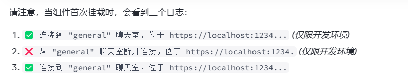

# react-learning
learning react 

## 什么是 Effect，它与事件（event）有何不同？

1. 如果某些逻辑必须在 每次应用加载时执行一次，而不是在 每次组件挂载时执行一次，可以添加一个顶层变量来记录它是否已经执行过了：
   ```js
    let didInit = false;

    function App() {
    useEffect(() => {
        if (!didInit) {
        didInit = true;
        // ✅ 只在每次应用加载时执行一次
        loadDataFromLocalStorage();
        checkAuthToken();
        }
    }, []);
    // ...
    }
   ```

   2. 每当你尝试保持两个不同的state 变量之间的同步时， 试试状态提升。
   3. 使用**清除函数**来忽略较早的返回结果
    ```js
        function SearchResults({ query }) {
            const [results, setResults] = useState([]);
            const [page, setPage] = useState(1);
            useEffect(() => {
                let ignore = false;
                fetchResults(query, page).then(json => {
                if (!ignore) {
                    setResults(json);
                }
                });
                return () => {
                ignore = true;
                };
            }, [query, page]);

            function handleNextPageClick() {
                setPage(page + 1);
            }
            // ...
        }
    ```

    ## Recap
    - 如果你可以在渲染期间计算某些内容，则不需要使用Effect。
    - 想要缓存昂贵的计算，请使用useMemo 而不是useEffect.
    - 想要重置整个组件树的state, 请传入不同的key.
    - 想要在props 变化时重置某些特定的state,请在渲染期间处理。
    - 组件**显示** 时就需要执行的代码应该改放在Effect 中，否则应该放在事件处理函数中。
    - 如果你需要更新多个组件的state,最好在单个事件处理函数中处理。
    - 当你尝试在不同的组件中同步state 变量时，请考虑状态提升，
    - 你可以使用Effect 获取数据，但你需要实现清除逻辑以避免竞争态条件。


## Effect 的生命周期  
1. Effect 只能做两件事，开始同步某些东西，然后停止同步它。
   effect 的清空函数，在组件的state,props 更新时会触发清空函数。
2. Effect **始终专注于单个启动和停止周期，无论组件是挂载、更新还是卸载，都不应该有影响。只需要描述如何开始同步和如何停止。如果做得好，Effect 将能够在需要时始终具备启动和停止的弹性**。
3. React 通过在开发环境中立即强制Effect 重新进行同步来验证其是否能够重新同步。
4. 
5. 通过effect 的依赖数组，来判断是否要重新进行Effect 同步。
6. 每个 Effect 表示一个独立的同步过程
7.  从组件的角度来看，空的 [] 依赖数组意味着这个 Effect 仅在组件挂载时连接到聊天室，并在组件卸载时断开连接。（请记住，在开发环境中，React 仍会 额外执行一次 来对逻辑进行压力测试。）
8.  当你不想进行重新同步时该怎么办，可以将依赖值移动到组件外部， **也可以将它们移动到Effect 内部**，它们不是在渲染过程中计算的，因此它们不是响应式的：


## 将事件从Effect中分开
1. 事件处理函数只有在响应特定的交互操作时运行。
2. 我们把show 默认值设置成false, 
3. 事件处理函数内部的逻辑是非响应式的。
4. Effect 内部的逻辑是响应式的。

## react 源码学习
- 异步可中断

- 代数效应（Algebraic Effects）
  ```js
    function getPrice(id) {
        const price = perform id;
        return price;
    }

    function getTotalPrice(id1, id2){
        const p1 = getPrice(id1);
        const p2 = getPrice(id2);

        return p1 + p2;
    }

    try {
        getTotalPrice('001', '002');
    } handle(productId) {
        fetch(`xxx.com?id=${productId}`).then((res)=>{
            resume with res.price
        })
    }
  ```
  - 这里的关键流程是perform 暂停函数的执行， handle获取函数执行权， resume 交出函数执行权。

## react 源码架构  
    const state = reconciler(update);
    const UI = commit(state);
- Scheduler（调度器）： 排序优先级，让优先级高的任务先进行reconcile
- Reconciler（协调器）： 找出哪些节点发生了改变，并打上不同的Flags（旧版本react叫Tag）
- Renderer（渲染器）： 将Reconciler中打好标签的节点渲染到视图上


> virtual-dom对象 （内存中用来描述dom阶段的对象）
